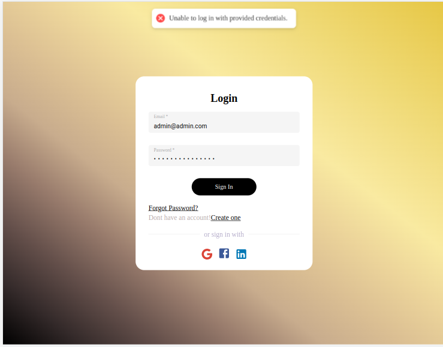

# Ecommerce Backend APIs

This project is a Django-based backend for an ecommerce application. It provides a set of APIs for managing ecommerce-related functionality, including models for products, orders, customers, and integration with Stripe for payment processing. The admin panel has been customized using the Jet theme.

> I have deployed this project on AWS EC2 which you can access by visiting this link http://13.50.25.74:8000/ or https://0b27-13-50-25-74.ngrok-free.app/

### Features
- Login API: Users can easily log in to the system using their credentials or through popular social media platforms like Facebook, Google, and LinkedIn. This provides a seamless and convenient login experience.

- Sign-up API: Users have the option to sign up as either a seller or a customer. This flexibility ensures that the platform caters to a wide range of user roles and requirements.

- Forgot Password API: In case users forget their passwords, this API allows them to recover access to their accounts securely and efficiently. I have done this Using SENDGRID user will recieve an email containing token to reset password

- CRUD APIs: The system provides comprehensive CRUD (Create, Read, Update, Delete) APIs for managing essential entities such as Products, Categories, Cart, Orders, and Customers. Additionally, customers can express their opinions by leaving reviews for both products and sellers. Sellers, on the other hand, have the ability to respond to these reviews, fostering a two-way communication channel.

- Stripe Payment APIs: To facilitate secure and reliable payment processing, the integration of Stripe Payment APIs ensures smooth transactions for both buyers and sellers.

- Customized Django Admin Panel: The platform offers a highly tailored and user-friendly Django Admin Panel, empowering administrators to efficiently manage the database and streamline administrative tasks.

- User-Friendly Front-End: A dedicated front-end interface (Made with React JS) complements the back-end functionality, providing users with intuitive login, sign-up, forgot and reset password, ecommerce landing pages integrated with the aforementioned APIs. Additionally, a visually appealing static landing page engages visitors and offers a glimpse into the platform's offerings.

- OpenAPI Integration (Swagger): With OpenAPI integrated via Swagger, developers can explore and interact with the platform's APIs effortlessly, fostering seamless integration with other systems and applications.

- AWS S3 Integration: Static files such as product images and user avatars are stored and managed using AWS S3. This integration ensures scalable and reliable storage, resulting in faster and more reliable content delivery.

## Getting Started

### Prerequisites

- Python (3.7)
- Django (2.2.3)
- Stripe Account (API keys required)
- PostgreSQL

### Installation
These instructions will help you set up and run the project on your local machine for development and testing purposes.

Command to clone this project

```
git clone https://github.com/huraira151/django_ecommerce_project.git
```

Then install pipenv and run this command

```
pipenv install
```

Create PostgresQL (install first along with postgis) Database using these commands

```
sudo -u postgres psql

CREATE DATABASE ecom_db;
CREATE USER ecom_user WITH ENCRYPTED PASSWORD '123';
GRANT ALL PRIVILEGES ON DATABASE ecom_db TO ecom_user;
```
Additional Info just for knowledge

> Command to import dumpfile in database<br> ```sudo psql -U importdump_user -d importdump -h localhost < file_dump.sql;```

Lastly

```
python manage.py makemigrations
python manage.py migrate
```

### Below are the screenshots of this project

Customized Admin Panel|                                        Browsable API                                        |Swagger (OpenAPI)
:-------------------------:|:-------------------------------------------------------------------------------------------:|:-------------------------:
  |  | 

Login Page                                                                    |                                    SignUp Page                                     |                              Forgot Password                               |                           Reset Password                                
:----------------------------------------------------------------------------:|:----------------------------------------------------------------------------------:|:--------------------------------------------------------------------------:|:-----------------------------------------------------------------------:
  |  |  | 
